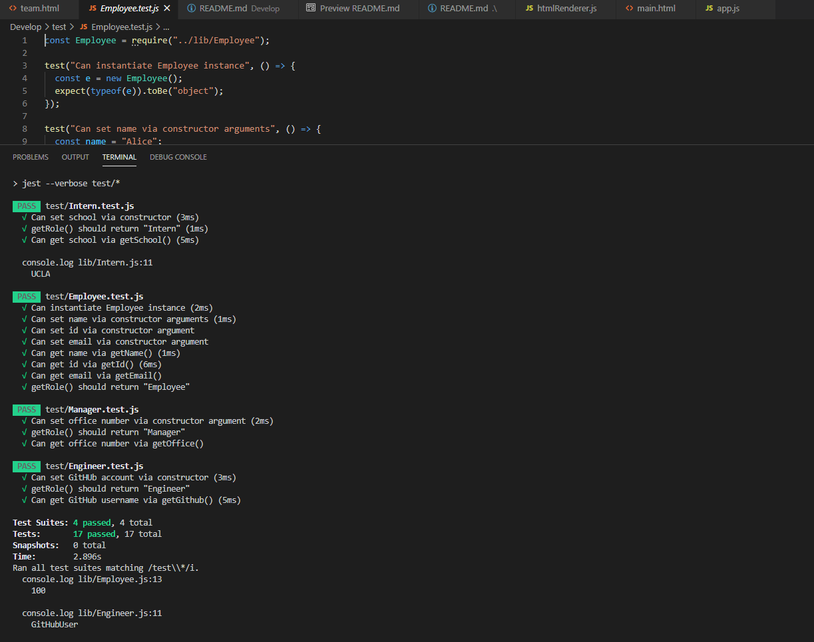

# Team Builder Profile Generator 
  

  ## Description ✏️
  
  The app takes user input the CLI and outputs a HTML file.  The user inputs information about their team with selection of different employee types.  The end product is a HTML that is rendered from the user input. 
  
  ## Table of Contents 📚
  
  * [Installation](#installation)
  * [Usage](#usage)
  * [License](#license)
  * [Contributing](#Contributing)
  * [Testing](#Testing)
  * [Questions](#Questions)
  
  ## Installation 

  ```
  📥 
  Run npm install - This will install dependencies of inquirer and Jest.  
  It is assumed that the user has node.js installed prior to accessing the team builder app. 
  ```

  ## Usage 

  ```
  ▶️ 
  node app.js - must be entered into the CLI to initate the app.  The a series of questions about the employees being added to the team appear.  
  The inputs have validation that needs to be adhered to.  Once the user has finished adding team members they select finish from the choices menu and a fully rendered HTML document is ready in the output folder. 
  Validation includes: 
  Name: No special characters or numbers for the employees name but spaces are permitted
  Id: The id must be a number and greater than 0 
  Email: must contain the @ symbol and '.com'
  Office number: Must be a number and be 8 characters long
  Github Username: No spaces permitted but special characters and numbers are allowed.

  ```
  For detailed run through video on using the team builder app [Click Here](https://drive.google.com/file/d/1CYhvIgTKvcQhhVvUeIiNwI5zXYUIe1ly/view)

  
  

  ## License 
  
  📜 License Code: GPL-2.0

  For detailed information on license [Click Here](https://opensource.org/licenses/GPL-2.0)
  
  ## Contributing
  
  👌 ensure to act ethically and always leave the code better than you found it
  
  ## Testing 

  ```
  ✔️ 
  npm run test - will kick of the testing procedure through Jest.  This tests all the files in the /lib directory.  All tests have passed at writing.  
  A Final test to ensure the app has run correctly would be to check the team.html in the /output dir and open the html document in the browser.
  ```
  For video on run Jest Test [Click Here](https://drive.google.com/file/d/11QLSO8ocOgl7CZlI_W6GDpiZg0mn38yk/view)

  

  ## Questions 
  
  Direct questions to me via email 📧 at [tmoschos@bigpond.com](tmoschos@bigpond.com).  Please use "Team Builder Profile Generator questions" in the subject and I will hopefully return a response within 48hrs.

  More information can be found at my [GitHub Profile](https://github.com/EMoschos).
  
---
This README was created by the "Great-Read" 📝 Node.js app.  Developed by Eleftherios Moschos
